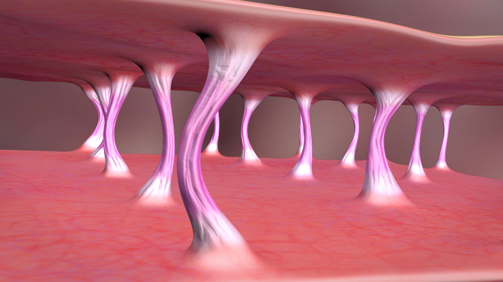

# 🫧**Proteínas, colágeno y enzimas**🫧

Las proteínas son moléculas fundamentales para la vida. Actúan como los bloques de construcción de las células, participan en casi todos los procesos biológicos y desempeñan roles esenciales como catalizadores, mensajeros y defensores del organismo. Este proyecto se enfoca en explorar su estructura, función y relevancia en la biología moderna.
A través de este proyecto, buscamos proporcionar una comprensión accesible, visual y educativa para estudiantes y conocer estas asombrosas biomoléculas.

Elaborado por: Mar Nirvana Shiguemtasu Betancourt y Andrea Flores Gil
Ing. Biomédica 
Noviembre 2024
